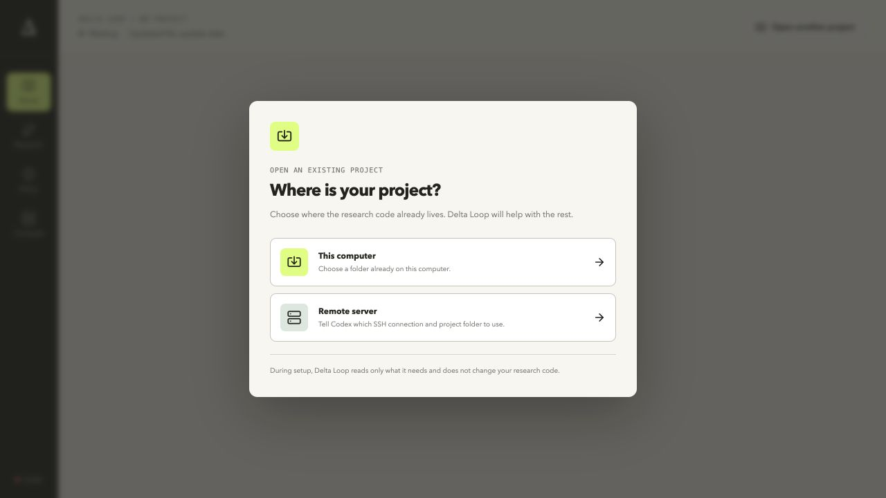

# Delta Loop

Delta Loop imports the useful scientific cycle from `delta-research` and makes that cycle visible, editable, and
versioned. It adds a visual idea map, persistent agent supervision, bounded handoffs, and clearer result review
without replacing the terminal.



## Install and open

You need Python 3.11 or newer. On macOS or Linux, copy and paste this once:

```bash
git clone --depth 1 https://github.com/user074/delta-loop.git ~/delta-loop && ~/delta-loop/install.sh
```

The installer prepares Delta Loop, adds the `delta-loop` command, starts the app, and opens it in your browser.
There is no address to remember.

If you already downloaded this repository, run:

```bash
./install.sh
```

Later, open Delta Loop with:

```bash
delta-loop
```

If your terminal does not find that short command, use `~/.local/bin/delta-loop`. Keep the terminal window open
while using Delta Loop; press `Ctrl+C` there to stop it.

To update later:

```bash
cd ~/delta-loop && git pull && ./install.sh
```

## First use

Choose where your existing research code lives:

- **This computer:** choose the project folder.
- **Remote server:** chat with Codex, then give it the SSH name you already use and the project folder on that server.

Codex maps the project structure and reads the relevant source and documentation. It then walks through the useful
parts of the `delta-research` starting process in short rounds: what the project does, what was already tried, the
starting questions and ideas, reusable code and data, what would count as success, when to stop, the available
compute, and how Git should be handled. It does not install software, run experiments, or change the remote
repository during setup. You approve the complete starting setup before Delta Loop saves it.

The proposed research map has three levels:

```text
High-level research question
├── Mid-level idea or possible explanation
│   ├── Concrete experiment
│   └── Concrete experiment
└── Mid-level idea or possible explanation
    └── Concrete experiment
```

Delta Loop keeps the number of ideas small and records when an idea is reframed, parked, reopened, or moved, so
you can review how the research direction evolved.

Finishing setup requires an actual compute check and an actual Git inspection. It creates the first research state,
summary, literature list, run folders, and a readable record of everything agreed during setup. The Home page keeps
that record available under **Starting setup**.

## What the POC can do

- Open an existing research project on this computer or an SSH server; import its `STATE.md` when present, or let Codex set it up when no state exists
- Use the full `delta-research` starting review when no state exists: project understanding, prior work, reusable inputs, research map, success and stopping rules, verified compute, and reviewed Git behavior
- Start with the real `user074/delta-research` cycle as an editable default and record its source revision
- Show the editable main question and keep its earlier wording when the question changes
- Present the latest result and review as a compact research-update slide
- Map every test and result back to the idea it examined
- Discuss the research map with an agent that can add, clarify, move, or park ideas and ways to test them
- Show which ideas worked, failed, remain uncertain, or have not been tested
- Start, reopen, or continue one persistent research-supervisor session from the Home page
- Keep detailed agent plans underneath while showing only the method, data, and question to the researcher
- Review the loop as main stages, child steps, or exact details; code, data, hardware, file, and Git instructions appear inside the steps that use them
- See whether an instruction came from `delta-research`, a researcher preference, or a local lab rule
- Set shared checks, temporary limits, and special rules for particular ideas
- Start a focused agent chat from configuration that needs discussion; simple choices stay directly editable
- Run an approved local command and keep its hidden detailed plan, output, and review together
- Choose whether research commands run locally or on one remote server through the user's existing SSH setup
- Check the remote project, Python, Git, and GPUs without starting research work
- See the actual research repository separately from Delta Loop's local control folder, and check its branch, remote, upstream, and changed files without fetching
- Let Codex manage reviewed commits and optional pushes only under explicit, checked Git policy rules
- Keep remote jobs running when the browser closes, reconnect to their status and recent logs, and show exactly where large output remains
- Limit how many independent approved plans may run at the same time
- Change the agent rules safely through checked, reversible versions
- Open a real terminal tied to the selected idea; hiding the panel does not stop the process
- Review whether a run followed the plan, whether the result is trustworthy, and what to do next

The installed app stores its own history in `~/.delta-loop/`. The developer version uses `.delta-loop-data/` in
this repository. For a local project, the following files live in the research project. For a remote project, they
live in a small local notes folder, so setup does not change the repository on the server:

- `.delta-loop/LOOP.md` is the complete active research loop used by the agent.
- `.delta-loop/POLICY.md` contains the researcher's active project and idea-specific choices.
- `.delta-loop/INITIALIZATION.md` records the approved research starting point, reusable inputs, boundaries, compute, and Git review.
- `STATE.md` starts the beliefs, literature checks, work list, and result ledger.
- `SYNTHESIS.md` starts the human-readable research summary.
- `INFRA.md` records the checked compute setup when the project does not already have one.
- `LITERATURE/INDEX.md`, `REPORTS/`, and `RUNS/` provide the initial research record folders.

Existing `INFRA.md` and `SYNTHESIS.md` files are reused rather than overwritten.

An agent started by Delta Loop receives both files before doing research. It does not read or combine another
supervisor prompt at runtime. Its built-in research cycle was adapted from
[user074/delta-research](https://github.com/user074/delta-research), but Delta Loop owns and runs the editable
policy. A local checkout is optional and used only when explicitly comparing upstream changes.

## Developer setup

Normal users should use `./install.sh` above. Changing Delta Loop itself also requires Node.js 20 or newer:

```bash
python3 -m venv .venv
source .venv/bin/activate
pip install -e '.[dev]'
npm --prefix web install
./scripts/dev.sh
```

The development command prints its local address. Unlike the installed `delta-loop` command, it keeps the UI and
API in separate development processes so browser changes can reload immediately.

If you hide the terminal in the web page, it keeps running. You can show it again in the page or attach
from another local terminal:

```bash
delta terminal attach TERMINAL_ID
```

Press `Ctrl-]` to detach without ending the shell.

An agent working in the embedded terminal can read the selected research context and update the same policy shown
in the UI:

```bash
delta context
delta project inspect-remote --host lab-gpu --project ~/projects/my-research
delta project read-remote --host lab-gpu --project ~/projects/my-research src/train.py src/model.py
delta project finish-setup --summary "Short project summary" --prior-work "Baseline result" --reference /path/to/reference --input /path/to/dataset --success "A reproducible answer" --stop "Ask before changing the dataset" --budget "Two small GPU runs" --permissions scoped --environment-verified --git-reviewed --constraint "Do not change the evaluation dataset"
delta compute show
delta compute inspect --local
delta compute inspect --host lab-gpu --project ~/projects/my-research
delta compute set --kind ssh --name "Lab GPU server" --host lab-gpu --project ~/projects/my-research --runs ~/.delta-loop/runs --setup "source .venv/bin/activate" --gpus 0 --max-parallel 1
delta compute check
delta compute reset
delta work start --approach APPROACH_ID --title "Small comparison" --goal "Test the smallest useful difference" --steps "Run the matched comparison once" --measure "Difference in the primary metric" --command "python experiments/quick_test.py --output {output_dir}"
delta work show
delta work cancel RUN_ID
delta policy show
delta policy set --kind quick-test --guidance "Run the matched comparison first."
delta question set "Updated research question" --reason "The recent result narrowed the scope."
delta map show
delta map add-question "How broadly does the effect generalize?" --summary "A second high-level question"
delta map add-idea "A possible explanation" --under QUESTION_ID --summary "Why it may matter"
delta map add-test "Smallest useful test" --under IDEA_ID
delta map connect QUESTION_ID IDEA_ID --relationship explores --note "This idea may answer both questions"
delta map connect ANOTHER_ID EXPERIMENT_ID --relationship tests
delta map connect EXPERIMENT_ID ANOTHER_ID --relationship informs
delta map disconnect LINK_ID
delta map update NODE_ID --status dormant
delta rules show
delta rules sync
delta rules add "Use GPU 0" --category temporary --when "Running this batch" --expires "When the batch finishes" --instruction "Use GPU 0 only."
delta rules update RULE_ID --off
delta rules apply UPDATED_RULES.json
delta harness show
delta harness update
```

The Research page is a graph with three readable columns: high-level questions, mid-level ideas, and concrete
experiments. A project can have several questions. An idea may connect to more than one question, and an experiment
may test or inform more than one idea. Connections have plain meanings—`explores`, `tests`, `supports`, `challenges`,
`informs`, `depends-on`, or `related`—and are drawn directly on the map. Selecting an item highlights only its
connections and shows the same relationships in the detail panel. Existing projects keep their original primary
parent for compatibility while Delta Loop automatically exposes that parent as a graph connection.

The map is also the entry point for changing the research. **Add question** starts a focused Codex conversation.
Selecting a question exposes **Add idea**; selecting an idea exposes **Add experiment**. Every selected item has
**Explore**, **Revise**, and **Connect** actions. Codex receives the selected item and current graph automatically,
proposes the change, and writes it only after the researcher approves it.

## Run research work on a remote server

Delta Loop itself stays on your computer. Its web page, terminal, research map, and policy files remain local. The
Compute page can send only approved research runs to one server over SSH. It uses the same host or alias that works
with `ssh HOST` in your terminal, so Delta Loop never stores SSH passwords or private keys.

On a clean start, choose **Remote server**. Delta Loop creates an empty local notes folder and opens Codex. Give
Codex the SSH host or alias and the existing project folder on the server. Codex recursively maps the source tree,
reads the main documentation and likely entry points, then follows relevant source files with focused read-only
requests until it can explain the project. It also checks the server environment. Generated data, environments,
outputs, model weights, binaries, credentials, and unrelated server folders are excluded. Nothing is installed or
run during this conversation. Codex proposes a high-level question, a few mid-level ideas, concrete experiments,
and the server setup. After you approve it, Codex populates the map, saves the connection, checks the exact
environment and repository state, records success, stopping, budget, and Git choices, creates the initial local
research files, and leaves the remote repository unchanged.

For each remote run, Delta Loop copies the sealed plan to the configured run-record folder, starts the command as a
background process, and reads its status and recent log over SSH. The job continues if the browser or Delta Loop is
closed. Large artifacts remain in the remote output folder shown on the Compute page; Delta Loop does not copy them
back automatically.

The **Set up with Codex** panel first asks whether work should run on this computer or a remote server, so the agent
starts with the right setup process. The local path inspects the current project and machine. The remote path asks
for an SSH host and project folder before connecting.

Use **Reset setup** on the Compute page, or `delta compute reset`, to clear the saved location and its inspection.
This does not delete run history, output, policy rules, or research files. A new local or remote choice is required
before another run can start.

The remote project and its Python environment should already exist. Codex begins with a recursive, read-only
`delta project inspect-remote`, follows relevant files with `delta project read-remote`, and runs one
`delta compute inspect`. Those checks report objective facts such as the project documentation and Git state,
environment candidates, visible GPUs, scheduler, storage, and an existing `INFRA.md`. Codex then asks the
researcher about choices the server cannot reveal: the approved environment, storage policy, GPU and concurrency
limits, login-node restrictions, and lab conventions. It saves compute settings and policy rules only after explicit
confirmation, then proves that the exact environment setup resolves Python with `delta compute check`.

Manual fields remain available as a collapsed fallback for researchers who already know the exact configuration.
Inspection and connection checks do not install software, clone code, move data, change Git, or start research work.

The **Git & GitHub** section on Compute points at the actual research repository: the local project folder for local
work, or `SSH_HOST:REMOTE_PROJECT_PATH` for remote work. It separately shows Delta Loop's local control folder so the
agent does not accidentally commit the local notes as if they were remote research code. **Check repository** reads
the branch, configured remote, upstream, changed paths, last commit, and cached ahead/behind counts. It does not
fetch, pull, switch branches, stage, commit, or push.

Use **Chat with Codex** in that section to decide what reviewed files belong in Git, when Codex may commit, whether
it should use the current branch or a work branch, and when it may push. The approved behavior is saved in the same
versioned policy that controls the research loop. Commit permission is separate from push permission; when no Git
rule is enabled, the agent must not commit or push. Large data, checkpoints, caches, secrets, and raw run output are
excluded unless the researcher explicitly chooses otherwise. The equivalent read-only commands are `delta git
check` and `delta git show`.

`delta harness update` updates the optional source checkout for comparison. It refuses to overwrite tracked local
changes or update a checkout that points at a different Git remote. It does not silently replace the active loop;
that loop remains a checked, reversible Delta Loop policy version.

The discussion buttons start Codex by default. Its command sandbox allows local connections so it can reach
Delta Loop at `127.0.0.1`, while other internet destinations remain blocked. Set `DELTA_LOOP_AGENT_COMMAND`
before starting Delta Loop to use another interactive agent command.

## Alternative: run Delta Loop itself on a remote server

The setup above keeps Delta Loop on your computer and sends only research commands to the server. You can instead
install and run the entire Delta Loop app on a remote server, then open it safely from your computer through SSH.
This is useful when the repository, environment, and agent should all remain on the server.

First, connect to the server and install Delta Loop without trying to open a browser there:

```bash
ssh YOUR_SERVER
git clone --depth 1 https://github.com/user074/delta-loop.git ~/delta-loop
~/delta-loop/install.sh --no-launch
```

### Keep Delta Loop running when SSH disconnects

If Delta Loop runs directly in a normal SSH terminal, assume it will stop when that SSH connection closes. The
recommended setup is to run it inside `tmux`, which keeps the server process alive after you disconnect.

On the server, create a named `tmux` session and start Delta Loop on the SSH-only address:

```bash
tmux new -s delta-loop
~/.local/bin/delta-loop --host 127.0.0.1 --port 4317 --no-open
```

Detach from `tmux` without stopping Delta Loop by pressing `Ctrl+B`, releasing the keys, and then pressing `D`.
You can now close the server's SSH connection. To see the Delta Loop process again later:

```bash
ssh YOUR_SERVER
tmux attach -t delta-loop
```

If the `delta-loop` session already exists, do not create another one. Attach to it with the command above. You can
also create the session in the background from your computer:

```bash
ssh YOUR_SERVER \
  "tmux has-session -t delta-loop 2>/dev/null || \
   tmux new-session -d -s delta-loop \
   '$HOME/.local/bin/delta-loop --host 127.0.0.1 --port 4317 --no-open'"
```

In a terminal on your own computer, create the encrypted SSH tunnel:

```bash
ssh -N -L 4317:127.0.0.1:4317 YOUR_SERVER
```

Then open [http://127.0.0.1:4317](http://127.0.0.1:4317) in the browser on your computer. Although the address
looks local, the page and Delta Loop process are running on the remote server through the SSH tunnel.

The tunnel command stays in the foreground. If your network changes, your computer sleeps, or that SSH connection
closes, the browser will temporarily lose access. Delta Loop itself continues running inside `tmux`; rerun the
tunnel command and reload the page to reconnect.

For a short session where you do not need Delta Loop to survive disconnection, you can start the app and tunnel
together with one command from your computer:

```bash
ssh -t -L 4317:127.0.0.1:4317 YOUR_SERVER \
  '~/.local/bin/delta-loop --host 127.0.0.1 --port 4317 --no-open'
```

In this arrangement, select **This computer** on Delta Loop's Compute page. Here, “this computer” means the remote
server where Delta Loop is running. Project paths shown in the UI must also be paths on that server. Delta Loop's
saved state is stored in `~/.delta-loop/` on the server.

`tmux` survives an SSH disconnection, but it does not survive a server reboot. If the server permits user services,
a user `systemd` service can provide automatic restart after reboot. On managed clusters, ask the administrator
before creating either a persistent login-node process or a user service.

Keep `--host 127.0.0.1`. Do not bind Delta Loop to `0.0.0.0` or open port 4317 in the server firewall; the SSH
tunnel provides access without exposing the web page to the network. If port 4317 is already used on your computer,
leave the remote app on 4317 and use a different local port:

```bash
ssh -N -L 4319:127.0.0.1:4317 YOUR_SERVER
```

Then open [http://127.0.0.1:4319](http://127.0.0.1:4319). On a shared cluster, check the site's rules before running
a persistent web process on a login node. If that is not allowed, keep Delta Loop on your computer and use the
earlier **Remote server** Compute setup instead.

## Validate

```bash
pytest
npm --prefix web run build
```

The product direction and POC acceptance criteria live in [`docs/POC_PLAN.md`](docs/POC_PLAN.md).
