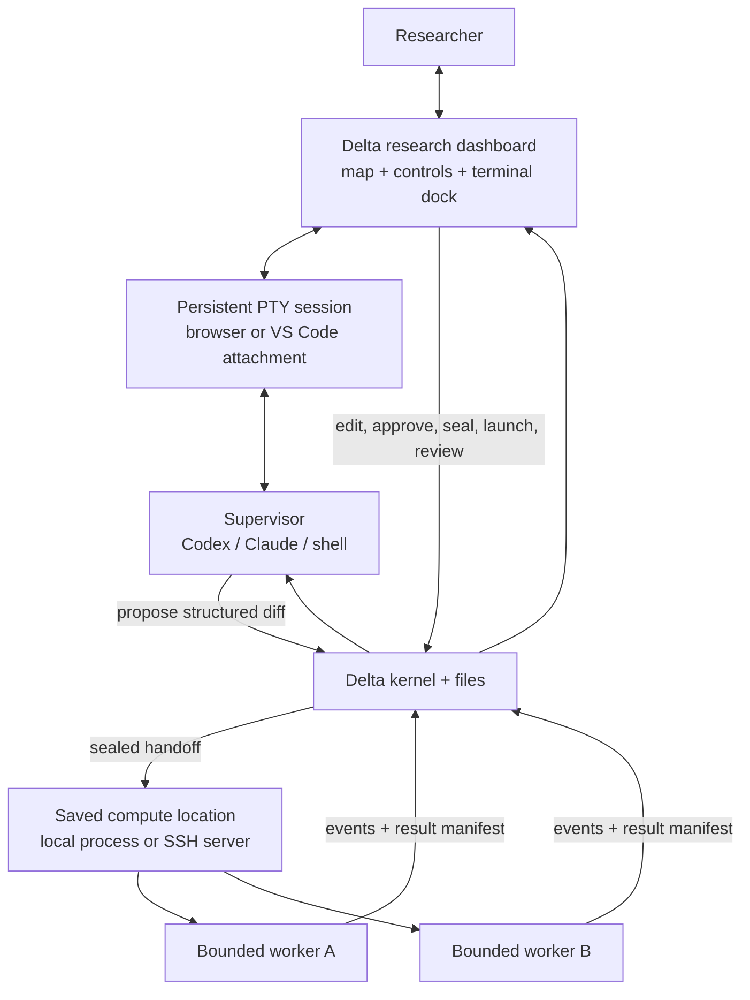
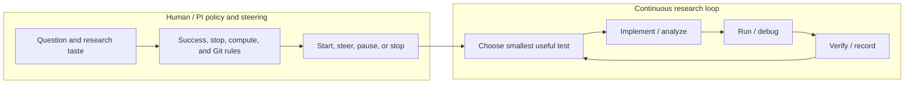

# Delta Loop — Revised POC Plan

**Status:** Revised draft for dogfooding

**Scope:** Local, single-researcher proof of concept

**Relationship:** An enhanced version of `delta-research`: Delta Loop imports its research cycle as the initial
default, then owns the complete editable and versioned loop used at runtime

## 1. Why this plan is being revised

The first POC plan correctly identified structured handoffs, parallel workers, research arcs, and PI-style briefings
as important. It also drifted toward building a new general-purpose agent orchestration platform: a daemon-owned
object database, generic lifecycle engine, worktree manager, adapter system, event index, and browser chat.

That is not the first uncertainty to resolve.

This revision starts from three sources of evidence:

1. **The existing `delta-research` project.** It already provides a useful file-backed scientific loop: project
   initialization, beliefs, experiment plans, worker reports, infrastructure profiles, SLURM execution, state
   compression, and synthesis.
2. **Experience using `delta-research`.** The scientific details remain auditable, but the human has difficulty
   seeing research arcs, switching among approaches, changing rules, allocating attention, supervising parallel
   work, and reconstructing the conceptual story from Markdown and terminal history.
3. **Experience building and using `loopit`.** A local web UI is useful for awareness, live activity,
   observability, durable state, and next-work visibility. It is less convincing as the primary conversation and
   control environment when each message launches a non-interactive CLI turn. Fresh construction, rehearsal,
   repair, worker, integration, and understanding turns can spend substantial tokens proving the loop while the
   target project receives little useful work.

The POC must therefore validate a narrower product:

> **Delta Loop is a companion research dashboard for an existing interactive agent workflow. It helps a researcher
> and a persistent supervisor turn scientific intent into constrained work packages, delegate bounded execution,
> observe progress, review evidence, and maintain the conceptual research arc. The terminal is embedded or
> attachable from that visual context, so the researcher can move between a direction, its approaches, and the
> live agent session without reconstructing context—while measuring whether tokens and time are advancing the
> research rather than the harness.**

The POC fails if it becomes an impressive dashboard around agents that mostly inspect, narrate, validate, or
repair Delta itself.

## 2. Current system, lived experience, and POC response

This table is the product requirements document for the POC. A proposed feature should trace to at least one row.

| Area | What exists now | Experience in real use | POC improvement |
|---|---|---|---|
| Scientific memory | `STATE.md` stores beliefs, confidence, a ledger, and a ranked frontier. | Useful for agent continuity, but too flat for the human's higher-level model of questions, competing approaches, and changes in direction. | Preserve the belief/evidence model and add `Research question → Arc → Approach → Work package`, including status rationale and revisit triggers. |
| Detailed audit trail | `PLAN.md`, `REPORT.md`, `RUNS/`, logs, metrics, plots, and Git history preserve details. | Details are available, but reconstructing the important story requires opening many files. | Keep details as the audit layer; add a PI briefing and drill-down links rather than replacing the source artifacts. |
| Human-facing summary | `SYNTHESIS.md` provides a narrative summary. | Better than raw reports, but still a static text projection with weak navigation and no control. | Render a visual briefing organized around conceptual changes, surprises, failures, decisions, and resource allocation. |
| Starting setup | `delta-research` uses `INIT.md` to inspect the project, interview the researcher, verify the environment, agree on permissions, ground seed hypotheses in literature, and create `STATE.md`, `SYNTHESIS.md`, `INFRA.md`, and research folders. | Constrained agents with concrete code, data, libraries, and baselines are much more effective than an unconstrained research prompt. The old Markdown-only setup is hard to inspect or revise, and a shallow one-pass scan misses important prior work and project structure. | Make this a Codex-led, researcher-approved starting review in Delta Loop. Inspect local or remote code read-only; propose high-level questions, a few mid-level ideas, and concrete experiments; record prior work and reusable inputs; require real compute and Git checks; agree on success, stopping, budget, permissions, and constraints; then generate the initial research files without overwriting existing `INFRA.md` or `SYNTHESIS.md`. Save the approved starting setup as structured state and `.delta-loop/INITIALIZATION.md`, and show it on Home. |
| Research planning | The supervisor selects a high-value delta and writes a detailed plan. | The agent can propose plausible experiments that do not match the researcher's intended ablation, comparison, metric, or scientific taste, but requiring approval for every plan leaves unattended research idle. | Let the researcher encode objective, controls, exclusions, taste, success, and hard stop rules before the run. During a continuous run, the supervisor makes and records plan-level choices under that policy without waiting between cycles. |
| Research protocol | Delta provides a common loop and package conventions. | Researchers differ in how they implement, ablate, and escalate experiments. One researcher may prefer the cheapest discriminating probe first and do a full investigation only after seeing signal; another may require replication or a complete benchmark before branching. | Import the Delta cycle as ordered policy steps, then let researchers edit those steps and add selectable investigation profiles without rewriting a long Markdown prompt. |
| Plan mutability | Plans are durable and increasingly constrained by templates. | Changing or adding rules during work is cumbersome and can be lost in conversation context. | Make the loop itself and its project-, idea-, and package-level rules editable through checked versions. Sealed packages retain the version they received. |
| Autonomy | The loop can choose the next frontier item and continue until an interrupt boundary. | Approval boundaries still stop the supervisor after a plan, result, ambiguous choice, or proposed larger study. If the researcher is away, useful progress ends. | **Start research** creates a durable Codex goal. The supervisor chooses, runs, reviews, records, and begins the next evidence-producing cycle without routine approval. It uses the smallest discriminating test when uncertain and redirects when one path is blocked. It stops only at saved success, stop, compute, budget, prohibition, access, or no-useful-work boundaries. |
| Supervisor interaction | The terminal agent acts as supervisor and spawns workers. | One long conversation is high bandwidth and natural, but planning, execution, and delegation become entangled. | Keep a persistent interactive supervisor terminal, but make it attachable from the UI and scope it to the selected direction, approach, or package. Give it a file/CLI protocol for proposing package and state changes. |
| Worker handoff | A worker receives a plan and returns a report. | This is valuable, but subagent ownership and intermediate decisions are often opaque. | Make the sealed work package and attempt first-class. Show exact scope, worker, status, deviations, result, and escalation without exposing every private reasoning token. |
| Parallelism | One supervisor may spawn subagents, often sequentially or opaquely. | Terminal use encourages one primary agent and sequential tasks even when independent analyses could run in parallel. | Let the researcher explicitly seal, queue, and launch up to two independent packages. Parallelism is package-based, not an invisible subagent tree. |
| Research evolution | Beliefs and frontier entries change after experiments. | An approach may become dormant rather than rejected and later become promising again. The reason for switching is important. | Record direction and approach activation, dormancy, reopening, rationale, evidence summary, invested effort, typed relationships, and revisit condition. |
| Lab-note capture | Research ideas are usually added by editing state or telling the agent. | A new direction may begin as one sentence in a lab note. Requiring a full hypothesis or package too early creates friction and loses speculative ideas. | Add one-line quick capture for a direction, approach, observation, or question. It appears immediately in the map as an unstructured note and may be enriched later without a model call. |
| Promise versus evidence | Confidence and frontier rank partially mix scientific support with what deserves attention next. | A weakly supported direction may still be promising; a well-supported result may have low priority. | Display three separate signals: activity status, human-rated promise/priority, and evidence strength. Never infer one from another. |
| Review semantics | A report proposes a verdict and belief update. | Method validity, observed result, scientific interpretation, and code quality are different judgments. | Separate execution review, observation acceptance, interpretation, belief update, and optional code integration. |
| Terminal workflow | The existing system works directly in the repository through agent tools and shell commands. | The terminal remains best for debugging, code inspection, commands, SLURM, and interactive collaboration, but it is visually disconnected from the research arc. | Make terminal sessions first-class and link them to directions, approaches, packages, and attempts. Clicking a node opens or reattaches its session; the same session can be attached from the browser or a local/VS Code terminal. |
| Codex file and Git access | A managed Codex chat can be started without command-by-command approval while still using a project-only filesystem sandbox. | The project-only sandbox cannot write protected Git metadata or reach every SSH, environment, and remote-project path needed for real research work. Codex can discuss Git policy but cannot carry out an approved commit. | Start managed Codex chats with full machine access so they can work in the actual local or remote repository. Keep this technical access separate from behavioral permission: enabled Git policy decides when Codex may stage, commit, or push, and push remains a separate choice. Allow deployments to replace the launch command when a stricter external boundary is required. |
| Compute location | Research code may live on a workstation or a remote GPU server. `delta-research` records infrastructure and follows a probe-then-interview setup: commands reveal hardware and software facts, while the researcher supplies storage policy, appropriate resources, and cluster or lab conventions. | On a server without SLURM, the researcher wants Delta Loop to remain local while approved commands run remotely. The agent must not guess the host, project path, environment, GPUs, storage policy, or safe concurrency, and the researcher should not have to manually transcribe everything into a form. | Make agent-led setup the main path. Run one bounded read-only probe; show detected facts separately from human choices; ask one short round at a time about the environment, storage, GPU and concurrency limits, login-node restrictions, Git, data, and lab rules; save only after confirmation; then validate the exact setup. Freeze the chosen location into every attempt, launch a persistent remote process, reconnect to status and logs, and show the remote output path. Keep manual fields as an advanced fallback and never store SSH credentials. Provide a safe reset that clears the saved location and inspection while preserving research files, run history, and results. |
| Git and GitHub | `delta-research` can ask an agent to inspect, commit, and sometimes push reviewed work, while IDE Git tools remain available. | For remote work, Delta Loop's local notes folder looks like a project folder but is not the actual research repository. Without a visible rule, an agent may use the wrong folder or the researcher must manually remember when to commit and push. | Put Git controls on Compute. Show the actual local or SSH repository separately from Delta Loop's control folder. Provide a read-only status check for branch, remote, upstream, changed paths, and cached ahead/behind counts. Keep commit, branch, result-record, and push behavior in checked policy rules. Codex discusses and saves those rules; commit permission never implies push permission. The finish-cycle step applies enabled Git rules to the actual compute project. |
| Web awareness | `loopit` shows live activity, state, next work, history, steering, and durable runtime records. | The awareness and observability are useful. Seeing what is happening and what comes next lowers uncertainty. | Reuse these interaction lessons in a smaller research dashboard: current package, current operation, latest evidence, next checkpoint, decisions needed, and resource use. |
| Web conversation | `loopit` construction and understanding messages launch CLI processes and rehydrate saved context. | A sequence of non-interactive `exec` turns feels less natural than a persistent agent session and repeatedly pays context/setup cost. | Embed or attach a real persistent terminal session, not a chat form that launches a new process per message. The UI adds visual context and structured controls around that session. |
| Loop verification | `loopit` can trace, rehearse, repair, and retest a loop using fresh agents. | The system may spend more tokens verifying that the loop works than producing the target project's native deliverables. | Use deterministic validation for schemas and invariants. Permit model-based review only for a named scientific or safety risk and only after real work exists to review. |
| State integration | `loopit` launches a fresh integration supervisor after each worker. | Independent integration can be useful, but it adds another full context load and model turn to every unit of work. | Batch review where possible. Use deterministic manifest ingestion; ask the persistent supervisor or human for interpretation only when scientific judgment is needed. |
| Observability generation | `loopit` normalizes provider events and also uses agent reports and understanding turns. | Tool and process events are helpful; extra narration and observer turns consume tokens without changing the project. | Derive live status from CLI/tool/process events. Require only sparse structured progress markers. An explanation agent is optional and user-invoked. |
| Token economy | Provider usage may be displayed, but runtime limits focus mainly on elapsed duration or iteration count. | High token usage can coexist with little project progress. Harness verification can look productive while crowding out real work. | Track tokens by role and compare them with durable research progress. Add overhead budgets, no-progress detection, and a hard requirement that the POC advance a real research question. |
| Loop evolution | `delta-research` behavior is spread across large Markdown templates, generated agent instructions, and repeated rules. Tests validate examples or ask an LLM to review outputs. | A small change may require editing several files, asking an agent to reason about consistency, and spending tokens without knowing whether the new behavior will actually fire. | Store the complete active cycle as ordered, composable policy entries and render one standalone `LOOP.md`. Show the result, check it with code, version it, and make rollback immediate. |
| Storage | `delta-research` uses readable Markdown. The first POC proposed a new JSON object store plus SQLite cache. | Markdown is agent-friendly; the problem is its human interface and weak control, not necessarily its existence. A full migration adds risk before value is proven. | Preserve current scientific files. Add structured files only for new concepts such as arcs, policies, packages, attempts, and review decisions. Defer SQLite and full migration. |
| Isolation | The first POC proposed one Git branch and worktree for every worker. | Many research tasks are read-only analyses or jobs against a fixed commit; worktrees add unnecessary setup and failure modes. | Use a fixed commit plus isolated run directory by default. Create a branch/worktree only when the package is allowed to change code. |

## 3. Product thesis and hypotheses

### Product thesis

Delta Loop should be the practical `delta-research++`: begin with the existing scientific loop, make that loop
easy to understand and change, and improve the boundary between human scientific judgment and delegated machine execution. It should not replace the
researcher's interactive agent, terminal, experiment tracker, or scientific judgment.

The human owns:

- The saved research questions, conceptual framing, and project prohibitions
- Research taste: preferred implementation, controls, replication, literature, and escalation policies
- Success, stopping, time, compute, Git, and resource limits
- Asynchronous steering, correction, pause, resume, and termination when the researcher is present

The continuous supervisor owns work inside those saved boundaries:

- Choose the next useful question or approach and turn it into an explicit work package
- Resolve ordinary ambiguity with the cheapest useful test instead of asking
- Run, debug, review, and redirect work when a path fails
- Maintain continuity, working interpretations, uncertainty, and the visual research map
- Start the next cycle without waiting for the researcher
- Prepare conceptual summaries so the researcher can steer later

Workers own bounded execution:

- Implementation details within declared authority
- Running, debugging, plotting, and routine analysis
- Local recovery that does not change the scientific question
- Producing auditable results and surfacing deviations

### POC hypotheses

| ID | Hypothesis | Evidence required |
|---|---|---|
| H1 | Structured supervisor-to-worker handoffs reduce rework caused by misunderstood research intent. | Compare package revisions, deviations, and discarded work with recent terminal-only work. |
| H2 | A research-arc view reduces the time needed to reconstruct why the project is pursuing its current approach. | The researcher can explain current direction, dormant alternatives, and revisit triggers in under five minutes after time away. |
| H3 | A companion UI improves awareness without replacing the terminal or interactive supervisor conversation. | The researcher uses the UI for state, review, steering, and drill-down while continuing substantive conversation and debugging in the preferred IDE/terminal. |
| H4 | Explicit token and progress accounting prevents meta-work from dominating real work. | Most agent expenditure produces native research artifacts, experiments, analysis, or accepted evidence; overhead stays within the configured budget. |
| H5 | Package-level parallelism increases useful throughput without hiding ownership or scientific decisions. | Two independent packages can run concurrently and return separately reviewable results without corrupting state or silently changing scope. |
| H6 | A visual research map linked directly to persistent terminals makes switching among directions easier without weakening interactive collaboration. | The researcher can capture a lightweight idea, click into an approach, resume its terminal context, inspect what worked or failed, and switch back without a fresh model session or manual context reconstruction. |
| H7 | Researchers can safely evolve the Delta harness when rules, templates, or delegation policies prove inadequate. | A researcher can change one rule, see every affected rendered prompt and package, pass deterministic and fixed-scenario tests, canary it on one package, observe whether it fired, and roll back without asking an agent to rewrite the harness. |
| H8 | Explicit researcher-specific investigation protocols produce better-scoped work than one universal experimental loop. | The researcher can encode a fast-signal-first protocol, apply it to one approach, and let the supervisor make and record evidence-based promote, repeat, redirect, or park decisions without silently exceeding the saved limits. |
| H9 | A durable continuous goal can advance research while the researcher is away without becoming unbounded. | The supervisor completes multiple evidence-producing cycles without routine approval, records why it chose and promoted work, stays inside saved limits, and stops only for a concrete hard condition. |

## 4. Product boundary

### The POC is

- An evolution of `delta-research`
- Local-first and single-researcher
- A browser-based companion UI with an integrated persistent terminal and a thin VS Code context bridge; the full
  UI can later be embedded as a VS Code webview
- A structured handoff and review protocol
- A lightweight visual research-direction graph and policy editor
- Editable research-protocol profiles for implementation, ablation, and experiment escalation preferences
- A versioned Harness Workbench for rules, templates, scenarios, activation, and rollback
- A bounded worker launcher and observer
- A progress and token-accounting experiment
- A complete editable research loop that remains compatible with existing Delta scientific artifacts
- A local control surface that can run bounded work on one saved SSH server without becoming a cluster scheduler

### The POC is not

- A general loop-construction product
- A general task manager or agent operating system
- A replacement for Codex, Claude Code, VS Code, or the terminal
- A chat form that launches a new coding-agent process for every message
- An unbounded scientist with no saved objective, success condition, resource limit, or stop rule
- A new experiment tracker competing with W&B
- A free-form research knowledge graph
- A universal scientific method or a hard-coded experiment sequence that every researcher must follow
- A full migration of every Delta Markdown file into a new database
- A platform whose own tests and rehearsals count as research progress
- A monolithic prompt whose behavior can only be evaluated by asking another agent for an opinion
- A remote machine provisioner, data-sync system, credential store, or replacement for SLURM

## 5. Interaction architecture

The browser is a **visual research dashboard with a real terminal attached**, not a second-rate chat wrapper around
one-shot CLI calls.



The POC has one active compute location per project. Delta Loop stays local and uses the researcher's normal SSH
configuration when that location is remote. Each attempt stores a copy of the host and paths it started with, so a
later configuration change cannot make an existing job appear to move. Remote output stays remote and is referred
to by its exact path; automatic dataset and artifact synchronization is outside the POC.

Remote setup follows the same epistemic boundary as `delta-research` infrastructure initialization:

1. **Probe facts once:** project presence and writability, repository state, environment candidates, Python,
   scheduler commands, visible GPUs, CPU, memory, storage, and any existing `README.md`, `STATE.md`, or `INFRA.md`.
2. **Interview for rules:** which environment is correct; where data, checkpoints, scratch, and caches belong; which
   GPUs and concurrency are appropriate; and what login-node, Git, data, or lab conventions apply.
3. **Confirm before mutation:** present the proposed compute settings and Delta Loop policy rules. Inspection never
   installs packages, moves data, edits Git or `INFRA.md`, creates the project, or launches research.
4. **Validate the agreed setup:** after confirmation, prove the project path and exact environment activation work.

The agent must not turn this into open-ended server exploration. One deterministic inspection should answer the
routine questions without consuming repeated agent turns; deeper investigation requires a specific problem or the
researcher's request.

When no project is open, the first choice is explicit: **this computer** or **remote server**. It is made in the UI
before the Codex conversation starts. Local setup opens an existing folder. Remote setup creates only a local Delta
Loop notes folder, asks for the existing SSH host and project path, and combines project understanding with compute
setup. The remote repository does not need a local checkout or a pre-existing `STATE.md`, and it remains unchanged
during onboarding. The agent does not spend a turn asking which of these two paths the researcher intended.

### The delta-research default

Delta Loop imports the concrete cycle from
[user074/delta-research](https://github.com/user074/delta-research): read the current state, select grounded work,
seal a plan, give it to a bounded worker, check the result, update research memory, and save or continue. These are
ordinary ordered policy entries inside Delta Loop. The researcher may rename, reorder, disable, replace, or add
steps through a checked version.

Delta Loop renders the active version into a complete `.delta-loop/LOOP.md` and writes current idea choices to
`.delta-loop/POLICY.md`. The supervisor does not read an outside `SUPERVISOR.md` at runtime. A recorded upstream
URL and revision are provenance for the imported default and allow future comparison; they are not a second
source of active behavior.

### Persistent terminal, not repeated `exec`

The high-bandwidth discussion that determines an ablation, rejects an irrelevant hypothesis, or changes a
conceptual framing benefits from a persistent interactive session with normal repository tools. Recreating that
relationship as a series of `codex exec` or `claude -p` requests repeatedly reloads instructions and project
context and turns the control panel into a weaker terminal.

For the POC:

1. Delta creates or registers a persistent terminal session for the research project.
2. The browser terminal dock attaches to that session through a local PTY service. A local terminal or VS Code
   terminal can attach to the same session with `delta terminal attach <session-id>`.
3. The researcher clicks a research direction, approach, or package. Delta changes the UI's active context and
   exposes the corresponding context bundle to the terminal; it does not silently send a model message.
4. The researcher continues a normal interactive Codex/Claude/shell session in that terminal.
5. The supervisor reads Delta's selected context and proposes changes through a narrow `delta package propose` or
   file-outbox protocol.
6. The UI immediately displays the proposed diff while preserving the terminal conversation.
7. The researcher accepts, rejects, or directly edits fields.
8. Only sealed packages are sent to bounded workers, which may use non-interactive execution.

Non-interactive CLI execution is appropriate for bounded workers because the handoff is explicit and the worker
is expected to return a result rather than sustain a collaborative conversation.

### Terminal session behavior

A `TerminalSession` is a durable control-plane object linked to zero or more research nodes and optionally one
package or attempt. Its process is interactive; its metadata and attachment history are durable.

The POC supports:

- Create a supervisor terminal from the Research map
- Attach and detach the browser without ending the process
- Reattach from a local or VS Code terminal
- Open a package's worker output as a read-only live terminal/log view
- Promote a read-only worker view to an interactive recovery session only through an explicit action
- Open referenced files, reports, plots, and diffs in VS Code from the selected node or terminal event
- Show which direction, approach, package, repository path, and code revision the terminal currently belongs to
- Give only one attached client the input lease at a time; other viewers remain read-only until they take control

Selecting a node does not rewrite terminal history or inject a hidden prompt. It updates the terminal session's
small durable `selected_context` pointer and renders a visible context chip above the terminal. The human or
supervisor explicitly decides when to read or discuss that context.

For the browser POC, terminal I/O uses a localhost-only PTY session service and a WebSocket-backed terminal
component. The same frontend can later use VS Code's native terminal API. Remote access, shared multi-user
terminals, and browser credential management are out of scope.

### VS Code context bridge

A thin Delta VS Code extension keeps editor context synchronized even when the full dashboard is open in a browser.
It observes:

- Active text editor or notebook
- Active tab, including Delta-owned webviews or custom editors when applicable
- Current file URI, workspace root, cursor line, and selected range
- Active Delta direction, approach, package, or evidence item selected in the extension-owned UI
- Active terminal identity
- Terminal working directory and command lifecycle when VS Code shell integration exposes them

The extension sends this metadata to the local Delta session service. A running shell cannot reliably discover
the active editor tab by itself, so Delta exposes the synchronized context through the terminal's visible context
chip and `delta context current` rather than pretending it is an automatic shell capability.

The context contains references, not file contents by default:

```text
Research: C1 Exception → Matched magnitude
Editor: src/decompose.py:184, selection 184–211
Terminal: T001, cwd /project, idle
Package: D017 draft v3
```

Changing the active editor updates this context record but does not send a message, paste text, or consume model
tokens. The human or supervisor explicitly chooses when to read the file, selection, or research context. Delta
does not attempt to inspect arbitrary external browser tabs or web pages that are not owned by its extension.

### Visual and terminal context stay synchronized

The research map and terminal are two views of the same work:

```text
click Direction A
  → show its approaches, evidence, outcomes, and allocation
  → attach or focus Direction A's supervisor terminal
  → expose Direction A's context bundle

click Approach A2
  → show why it is promising, active work, nulls, failures, and open questions
  → focus A2's terminal tab or create one

click D017
  → show sealed handoff, live attempt, events, artifacts, and review
  → open worker output or the associated recovery terminal
```

Terminal events may update operational status and artifact links. They do not automatically change promise,
evidence strength, scientific interpretation, or direction priority.

### UI-generated observability must be cheap

Live state should come primarily from:

- Provider tool and command events
- Process state and exit status
- File changes
- SLURM or local job state
- Sparse worker progress markers
- Registered metrics and artifacts
- Package and attempt state transitions

The POC must not launch a second agent merely to narrate what the first agent is doing. An optional explanation
request may launch a read-only agent only when the user explicitly asks a semantic question that deterministic
state cannot answer.

## 6. The two loops

Delta must keep human policy and steering distinct from the continuous research loop. The researcher does not have
to sit between every cycle.



The continuous loop may run for a long time, recover routine failures, choose comparisons and measurements, record
working interpretations, promote promising results, and redirect among eligible paths. It keeps the saved main
question stable; evidence for a different framing becomes a connected question for later review rather than a
reason to stop unattended work.

A selected research protocol guides automatic movement between cheap probes, replication, confirmation, full
investigation, redirect, and stop. Promotion is allowed when evidence and saved resource limits justify it. A
project-specific hard rule can still prohibit a transition.

## 7. Minimal product surfaces

The POC has four connected surfaces, one contextual drawer, and a persistent terminal dock. The dock follows the
selected research context but may be pinned while the researcher compares another part of the map.

### 7.1 Briefing

The default screen answers:

- What changed conceptually since the last review?
- What produced accepted evidence?
- What was attempted but failed, was rejected, or remains invalid?
- What was surprising relative to predictions?
- Which approaches gained or lost priority, and why?
- Where did human time, agent time, tokens, and compute go?
- Which decisions require the researcher?
- What does the supervisor recommend allocating next?

Activity facts may use all attempts. Scientific claims must distinguish accepted evidence from provisional,
rejected, invalid, or unreviewed results. Every statement links to the relevant package, attempt, report,
artifact, plot, command, or decision.

The initial briefing is an interactive HTML view, not a generated slide deck. Its visual hierarchy should resemble
a concise PI update: claims and decisions first, evidence one click deeper, raw logs last.

### 7.2 Research

The Research surface is a bounded visual graph optimized for lightweight lab notes and research navigation. Setup
starts with three readable abstraction levels, but the active research trace is not restricted to that hierarchy:

```text
One or more research questions
  Ideas / directions
    Concrete experiments
```

An idea is a meaningful explanation, mechanism, or strategic way to attack one or more research questions. An
experiment is one concrete implementation, comparison, dataset, ablation, or measurement. Work may instead be a
literature review, replication, analysis, or research-engineering task. Work can produce a durable finding, and that
finding can revise an existing idea, create a follow-up idea, or motivate different work. Each item can start with
only a title and a short note; Delta should not force the researcher to fill a large form before preserving it.

The graph supports a small set of typed relationships:

```text
explores          Question → Idea
tests             Idea → Experiment
produces          Work → Finding
revises           Finding → changed Question or Idea
leads-to          Any research item → its next main step
alternative-to    Any research item ↔ a competing path
supports          Any research item → another research item
challenges        Any research item → another research item
informs           Any research item → another research item
depends-on        Any research item → prerequisite research item
related           Any research item ↔ another research item
```

Each item keeps one main placement so the page can draw a readable left-to-right research trace. Additional typed
links are lighter cross-connections. Columns represent successive steps rather than fixed item types, so the trace
can extend through review → idea → experiment → finding → revised idea → follow-up work. Existing imports retain
their compatibility parent and render without migration. Semantic zoom switches among an overview of questions and
ideas, the complete working trace, and detailed evidence/run cards. Selecting an item emphasizes its incoming path,
following branch, and immediate cross-links; the researcher can temporarily hide later steps from any selected item.

The graph is an interaction surface, not only a report. The map header can start a new-question conversation.
Every item exposes Continue from here, Literature review, Chat, Revise, and Connect. Questions add ideas, ideas add
experiments, work records findings, and work or findings create follow-up ideas. These actions open Codex with the
selected item, current graph, and intended operation already in context. Human-initiated structural edits remain
conversational and require confirmation rather than becoming a dense form editor. During a continuous run, the
supervisor may append findings, links, working interpretations, and status updates allowed by the active policy
without pausing for approval; every change remains auditable.

A research-map item records the applicable parts of:

```text
title
short lab note
current thesis, optional until enriched
status: primary | active | dormant | closed
status rationale
promise: high | medium | low | unassessed
evidence strength: strong | mixed | weak | none
priority / allocation
started_at
last_revisited_at
revisit trigger
typed relationships
accepted evidence summary
contradicting evidence summary
worked / null / failed / blocked outcome counts
human time, worker time, tokens, and compute
linked packages
linked terminal sessions
```

`status`, `promise`, and `evidence strength` are intentionally independent:

- **Status** says whether the researcher is currently working on it.
- **Promise** is the researcher's judgment about expected value or opportunity.
- **Evidence strength** summarizes how strongly current accepted observations support its claims.

A dormant approach may remain highly promising but temporarily blocked. A strongly supported direction may be
low priority because it is already sufficient for the paper. The UI must not collapse these distinctions into one
progress score.

#### Low-friction lab-note capture

From any empty space or selected node, the researcher can press **Add note** and enter one line such as:

```text
Maybe C1 is different only because its update norm is much larger.
```

The note is saved immediately, without a model call, as one of:

```text
unclassified note | possible direction | possible approach | observation | question
```

The researcher may drag or link it to a direction, convert it into an approach, or ask the persistent supervisor
to refine it later. Unclassified notes remain visible in an inbox and are not silently promoted into hypotheses or
work packages.

#### Visual language

The map should answer the main PI questions at a glance:

- Node size or lane position: current human allocation, not scientific truth
- Border/state treatment: primary, active, dormant, or closed
- Promise badge: human-rated high, medium, low, or unassessed
- Evidence bar: strong, mixed, weak, or none
- Outcome strip: worked, null, failed, and blocked package counts
- Active pulse: a worker or interactive terminal is currently operating in this context
- Edge label: alternative, dependency, derivation, or evidence relationship

Color is never the only encoding. The overview should remain legible with approximately 5–20 directions and
approaches; larger projects may collapse subtrees or filter by status.

The UI must make switching direction a first-class event:

```text
Approach A1: active → dormant
Reason: the current intervention does not separate magnitude from objective.
Revisit when: a matched-magnitude checkpoint or equivalent control exists.

Approach A2: dormant → primary
Reason: R041 provides a feasible discriminating test.
```

Clicking either approach opens its detail dock and focuses or offers to create its persistent supervisor terminal.
The detail dock shows the short lab note first, then the conceptual trajectory, packages, evidence, resource use,
and typed links. Raw run details remain drill-down content.

### 7.3 Handoff

The Handoff screen is a structured specification editor, not a chat window. A package contains:

- Title, kind, template, linked arc, and linked approach
- Research intent and exact uncertainty to resolve
- Current interpretation and competing explanations
- Objective and non-objectives
- Predicted outcomes and what each would imply
- Required controls, ablations, baselines, and statistical checks
- Exact inputs: repository, code revision, scripts, datasets, checkpoints, prior artifacts, and libraries
- Constraints and prohibited changes
- Worker-autonomous decisions
- Decisions requiring escalation
- Deliverables and acceptance evidence
- Time, token, and compute budgets
- Writable paths and execution environment
- Applicable project, arc, and package policy versions

Supervisor proposals appear as field-level diffs. The researcher may accept individual changes, reject them, or
edit directly. Sealing produces an immutable package version. Any scientific change after sealing creates a new
version; a routine execution repair is recorded on the attempt without rewriting the package.

### 7.4 Work and Review

The work surface shows packages rather than agent hierarchies:

```text
D017  matched-magnitude analysis    running       worker: Codex A
D018  decomposition cleanup         needs input   worker: Claude B
D019  cross-method control          ready         unassigned
```

Opening a package shows:

- Sealed handoff and applicable policies
- Attempt and worker identity
- Attached supervisor, worker-output, or recovery terminal sessions
- Current concrete operation
- Elapsed time, token use, compute use, and latest heartbeat
- Tool/process events with full logs expandable
- Produced code, metrics, plots, reports, and other artifacts
- Deviations and repairs
- Worker questions and escalation context
- Verification results
- Review decisions and follow-up packages

Review is separated into:

1. **Execution validity:** Was the sealed method followed, and are the artifacts reproducible?
2. **Observation acceptance:** Are the measured results trustworthy?
3. **Interpretation:** What does the observation support, contradict, or leave unresolved?
4. **Research update:** Which beliefs, arcs, approaches, or priorities change?
5. **Code integration:** Should any engineering change be retained or merged?

These decisions may have different outcomes. A valid null result can be accepted without supporting the tested
hypothesis. Trustworthy evidence can be accepted while interpretation remains deferred.

The terminal dock can be opened from a package without leaving review. Worker terminals are read-only by default;
an explicit **Take over for recovery** action creates or attaches an interactive session and records that human or
supervisor intervention on the attempt.

### 7.5 Context, Protocol, and Policy drawer

The drawer is available from Research and Handoff. It edits four distinct layers:

- **Project context:** research question, repositories, datasets, checkpoints, libraries, evaluation harnesses,
  infrastructure, reference work, and global prohibitions
- **Research protocol:** the researcher's preferred investigation stages, implementation style, ablation
  standards, default budgets, evidence limits, and promotion or stop gates
- **Arc policy:** preferred methods, relevant benchmarks, compute allocation, interpretation standards, and
  arc-specific constraints
- **Package policy:** the exact authority and boundaries for one delegation

The UI shows the effective merged context, protocol, and policy precedence. Updates apply prospectively; already
sealed packages retain a snapshot and show when they differ from the current configuration.

### 7.6 Research Protocol editor

A research protocol captures **how this researcher prefers to investigate**, without embedding that preference
in Delta's product harness. Profiles are reusable and editable, and an approach may select a profile plus a
small explicit override.

The POC ships examples as starting points, not privileged methods:

- **Fast signal first:** cheapest genuinely discriminating probe → confirm signal → full investigation
- **Replication first:** reproduce the motivating result → vary one dimension → investigate mechanism
- **Mechanism first:** establish a controlled causal intervention → characterize scope → test robustness
- **Benchmark first:** establish a complete baseline matrix → introduce the method → ablate components

For the user's default fast-signal-first profile:

| Stage | Purpose | Typical scope | Permitted conclusion | Gate |
|---|---|---|---|---|
| Minimal probe | Learn whether the predicted directional difference exists at all | Simplest reusable code path, small slice or one representative setting, sanity baseline, strict budget | Exploratory signal, no signal, invalid, or ambiguous; never a final claim | Agent chooses confirm, revise, redirect, or park from the checked result |
| Signal confirmation | Check that the first difference is not an obvious accident or implementation artifact | Repeat, matched control, essential confound check, limited additional settings | Provisional evidence suitable for allocating more effort | Agent chooses full investigation, another confirmation, changed test, or redirect within saved limits |
| Full investigation | Establish magnitude, boundary conditions, robustness, and interpretation | Full data/settings, planned ablations, multiple seeds where meaningful, failure analysis | Evidence eligible for formal claim review | Agent records the checked evidence, limits, working conclusion, and next useful path |

Each profile defines stage names, recommended package template, defaults, budgets, required controls, completion
signals, allowed next stages, and which transition is prohibited or requires the unattended run to stop. It may supply defaults but cannot
silently weaken a project prohibition, deterministic safety rule, provenance requirement, or a sealed package.

Editing from the UI, CLI, or profile file creates a new immutable profile version and shows how representative
packages would change. It requires no model call. Assigning the new version changes future package drafts only;
existing sealed packages and attempts retain their snapshot.

Profiles are ordinary importable and exportable files. A researcher may keep personal defaults and share a
profile, but each project pins or copies the resolved version it used so another person's later edits cannot
change the meaning of an existing experiment.

```text
delta protocol show --effective --approach A002
delta protocol diff fast-signal-first@v1 fast-signal-first@v2
delta protocol import /path/to/researcher-profile.json
delta protocol assign fast-signal-first@v2 --approach A002
delta protocol decide D017 --action promote --to full-investigation
```

In the Research view, each approach shows its current protocol stage and stage history. After review, Delta may
present **promote**, **repeat**, **revise**, **redirect**, or **stop** as structured choices. It never equates a
metric difference with successful confirmation or automatically launches the next stage.

### 7.7 Harness Workbench

Research protocols describe **how this researcher prefers to investigate**. Project and arc policies describe
**what this research wants**. The harness describes **how Delta itself operates**: which states exist, what a
supervisor or worker must produce, which boundaries require escalation, how plans and reports render, and which
validations run.

The Harness Workbench makes that operating layer visible and editable without requiring the researcher to locate
duplicated prose across `SUPERVISOR.md`, `INIT.md`, `AGENTS.md`, `PLAN.template.md`, and other files.

The screen shows:

- Active harness version and source bundle
- Rule tree grouped by planning, execution, observation, review, continuation, publication, and safety
- Where each rule applies and which higher- or lower-scope rule overrides it
- Enforcement type: deterministic, agent-evaluated, or human judgment
- Every Markdown prompt, template, schema, and package field affected by a proposed change
- Rendered before/after prompt and handoff previews with token estimates
- Static validation, scenario-test, canary, and live-observation status
- Runtime counts for `applied`, `not_applicable`, `violated`, `overridden`, and `unknown`
- Version history, activation scope, and one-click rollback

A researcher can directly change a structured rule or Markdown template. A supervisor may propose a patch, but
Delta shows the same diff and tests regardless of who authored it. Simple changes never require a model call.

Example:

```text
Rule: research.plan.require_matched_control
Scope: ablation packages
Enforcement: deterministic readiness check

Before
  Required controls: optional

After
  At least one matched control is required.
  Waiver requires a human rationale.

Affected
  ablation package schema
  HANDOFF.md rendering
  readiness validator
  scenarios S014 and S022
```

The Workbench has a **Test candidate** action, not a generic “ask an agent whether this is good” button. It runs
the cheapest applicable checks first and explains what remains inherently uncertain.

## 8. Research package templates

Templates are a core product feature because useful agents start from concrete initial conditions rather than an
unconstrained objective.

A template defines the fields required for one package; a research protocol defines when and at what depth that
template is used. The same ablation template can therefore produce a cheap exploratory probe or a full
confirmatory study. Every package records its protocol profile, stage, intended evidence level, and promotion
question so the worker cannot mistake a minimal probe for a complete investigation.

The POC implements four research-native templates:

### Discriminating experiment / ablation

- Competing explanations
- Exact intervention and comparison
- Required controls and matched variables
- Primary and secondary metrics
- Predictions under each explanation
- Confounds and falsification conditions

### Exploratory analysis

- Observation or anomaly motivating exploration
- Fixed dataset, checkpoint, and analysis scope
- Permitted exploratory degrees of freedom
- Required descriptive outputs
- Boundary between exploration and confirmatory claims
- Follow-up criteria

### Replication / robustness

- Result being replicated
- Original environment and evidence
- Dimensions held fixed and intentionally varied
- Equivalence criteria
- Failure classification
- Conditions for updating confidence

### Research-support engineering

- Research capability being enabled
- Existing code and interfaces to reuse
- Required behavior and tests
- Scientific invariants that code changes must preserve
- Migration and rollback expectations
- Explicit statement that engineering completion does not itself establish a scientific claim

Literature review can remain an existing `delta-research` run type during the POC. A dedicated UI template should
be added only after one real project demonstrates that it needs distinct controls.

## 9. Minimal domain model

### ProjectProfile

Imports the useful parts of `STATE.md`, `INFRA.md`, repository configuration, reference repositories, datasets,
checkpoints, environment, evaluation conventions, and default policies.

### ResearchQuestion, ResearchIdea, and Experiment

Represent the human's conceptual organization and history of allocation. They do not replace scientific claims.
Each has a short lab-note representation, independent status/promise/evidence signals, typed graph links, outcome
summaries, and linked terminal sessions. A project may have multiple high-level questions, shared ideas, and
cross-cutting experiments.

### LabNote

A low-friction, human-authored capture with text, timestamp, optional type, optional parent, and optional links.
Creating one never invokes a model. Promotion into a direction, approach, claim, or package is an explicit action
that preserves the original note.

### Claim

A minimal structured projection of an existing Delta belief or hypothesis:

```text
id
statement
kind: hypothesis | interpretation | assumption
status
confidence_or_strength
key_evidence
linked_arcs_and_approaches
```

The POC may import claims from the existing belief table. It should not invent a full knowledge graph.

### Policy

A versioned project-, arc-, or package-level rule with scope, rationale, precedence, and effective time.

### ResearchProtocol and ProtocolStage

A versioned, reusable description of the researcher's preferred investigation process. It is configuration, not
product harness code:

```text
id
name
rationale
stages[]:
  id
  purpose
  recommended_package_template
  default_scope_and_budget
  required_controls
  permitted_evidence_level
  completion_signals
  allowed_next_stages
  promotion_authority: human | deterministic
```

An assignment links an effective protocol version to a project, direction, or approach. A sealed package
snapshots the selected stage and effective overrides. Stage history records `promote`, `repeat`, `revise`,
`redirect`, and `stop` decisions with rationale; a result never promotes itself.

### WorkPackage

The persistent, versioned handoff contract. Only a sealed package may be delegated.

### Attempt

One execution of one sealed package version. It records the worker, code revision or worktree, run directory,
budgets, timestamps, token usage, compute use, events, repairs, exit condition, and retry relationship.

### TerminalSession

An interactive supervisor, shell, worker-output, or recovery session with:

```text
id
kind: supervisor | shell | worker-output | recovery
project_root
linked_research_nodes
linked_package_or_attempt
process_or_pty_identity
provider_session_identity, when available
working_directory
code_revision
selected_context
editor_context
created_at
last_attached_at
state: starting | active | detached | exited | lost
input_lease_holder
```

The terminal transcript may remain in the provider's normal session history or an attempt log. Delta stores only
the metadata and operational events needed for attachment and audit; it does not make private model reasoning a
research artifact.

### ResultManifest

A machine-validated index over the human-readable report and native artifacts:

```text
outcome: completed | partial | failed | blocked
summary
work_performed
deviations
observations
verification
artifacts
unresolved_questions
proposed_interpretations
proposed_follow_up
usage
provenance
```

### ReviewDecision

Records execution validity, observation acceptance, interpretation, research update, and code integration as
separate decisions with rationale and evidence references.

### LoopVersion

A loop version groups the ordered cycle steps with compatible extra rules, templates, renderers, validators, and
fixed examples. Every immutable version records its parent, source provenance, author, rationale, validation
results, and activation history. One active version generates the complete runtime instruction.

### HarnessRule

A stable, addressable operating rule:

```text
id
description
scope
applies_when
effect: require | prohibit | default | escalate | render | validate
enforcement: deterministic | agent | human
severity
rationale
source_module
dependencies
conflicts
test_scenarios
```

Markdown remains available for rich instructions, but behaviorally important prose must belong to a stable rule
ID or template fragment so Delta can show where it is rendered and whether it was observed at runtime.

### HarnessScenario

A fixed given/when/then fixture containing project state, policy, package, worker result or event inputs, expected
rendered fragments, expected deterministic findings, expected lifecycle outcome, and optional rubric assertions
for a targeted model evaluation.

### Event

An append-only machine event for lifecycle changes, progress, escalation, policy changes, review, and allocation.
High-volume raw provider output stays in attempt logs rather than bloating the conceptual event history.

## 10. Storage and compatibility

The POC is additive. It does not demote the existing scientific artifacts to generated compatibility files.

```text
project-root/
├── STATE.md
├── INFRA.md
├── SYNTHESIS.md
├── REPORTS/
├── RUNS/
└── .delta/
    ├── project.json
    ├── policies.json
    ├── protocol-assignments.json
    ├── protocols/
    │   └── fast-signal-first/
    │       └── v1.json
    ├── research.json
    ├── claims.json
    ├── notes.jsonl
    ├── sessions/
    │   └── T001.json
    ├── harness.lock.json
    ├── harness/
    │   ├── drafts/
    │   ├── versions/
    │   │   └── H003/
    │   │       ├── manifest.json
    │   │       ├── rules/
    │   │       ├── templates/
    │   │       ├── schemas/
    │   │       ├── scenarios/
    │   │       └── validation.json
    │   └── runtime-traces/
    ├── packages/
    │   └── D017/
    │       └── v1/
    │           ├── spec.json
    │           └── HANDOFF.md
    ├── attempts/
    │   └── A001/
    │       ├── attempt.json
    │       ├── events.jsonl
    │       ├── usage.json
    │       └── result.json
    ├── decisions/
    └── briefing/
```

Rules:

- Existing Delta files remain readable and usable by current agents.
- New structured objects use schema-versioned JSON and atomic writes.
- Human-readable handoffs and reports remain Markdown.
- The kernel uses file locking or optimistic object versions for concurrent control writes.
- SQLite is not part of the first POC. Add a rebuildable index only after measured query latency justifies it.
- The kernel is a headless library used by both the CLI and the web API. Research does not stop because the UI or
  HTTP daemon is closed.
- The browser may detach from a terminal without ending it. A small local session service owns PTYs and exposes a
  local socket/WebSocket attachment protocol; terminal metadata is persisted under `.delta/sessions/`.
- If the session service restarts and cannot recover a PTY, Delta marks the session `lost` rather than pretending
  it is live. Long-running experiments remain owned by their process, scheduler, or worker attempt and are
  reconciled independently.
- Workers never modify central `.delta` research, claim, policy, or decision state. They write only their assigned
  project scope, attempt events, artifacts, and result manifest.

### Isolation policy

| Package behavior | Default isolation |
|---|---|
| Read-only analysis, literature, or evaluation | Fixed Git commit plus unique run/output directory |
| SLURM experiment using existing code | Fixed Git commit, immutable plan, unique run ID and artifact paths |
| Code-changing research experiment | Dedicated branch/worktree plus unique run directory |
| Engineering package | Dedicated branch/worktree |

## 11. Evolvable harness and verification

The existing Markdown harness remains valuable as an agent-readable format. The POC changes how it is authored,
composed, activated, and tested.

### 11.1 Separate source rules from rendered Markdown

The active loop is compiled from:

```text
ordered research-loop steps
  + code / data / hardware / Git details attached to the steps that use them
  + checks and temporary limits that apply across steps
  + selected research-protocol snapshot
  + research project / direction / package policies
  + package template
  = effective loop snapshot
    → rendered HANDOFF.md, prompts, schemas, and validators
```

Markdown is an output and an authorable template, but it is no longer the only location where enforceable
behavior exists. Rules that affect lifecycle, authority, required fields, escalation, budgets, paths, or
verification receive stable IDs and structured definitions. Narrative scientific guidance may remain Markdown.

This avoids two bad extremes:

- A monolithic prompt where every behavior is implicit and difficult to test
- A rigid workflow engine that tries to encode scientific judgment as software transitions

The enforcement type remains explicit:

| Type | Appropriate uses | How it is tested |
|---|---|---|
| Deterministic | Schemas, required controls, permissions, paths, lifecycle, immutable fields, budget checks | Static checks and fixed fixtures |
| Agent-evaluated | Whether an ablation is genuinely discriminating, whether an explanation ignores a confound | Targeted rubric on fixed scenarios, optionally a model call |
| Human judgment | Scientific taste, interpretation, promisingness, material direction changes | Visible decision request; never reported as automatically verified |

### 11.2 Composition and precedence

Delta displays three composed stacks rather than pretending they are the same kind of rule:

```text
Operating contract:    active loop version < project rule
Investigation style:   selected protocol profile < project override < direction / approach override
Scientific constraint: project policy < direction policy < sealed package constraint
```

The three stacks compose into the sealed handoff, but a protocol preference cannot override a harness authority
boundary or scientific prohibition. A more specific layer may override a broader layer only when the broader
rule declares that field overridable. Hard safety, provenance, and immutability rules cannot be weakened by an
ordinary project override. Conflicts are validation errors rather than prompt paragraphs that silently disagree.

The Workbench can answer:

- Which rule produced this worker instruction?
- Where else is this requirement rendered?
- Which package templates will change?
- Does a project or direction override it?
- How many active or sealed packages use the old version?
- Will the change increase prompt size or duplicate another rule?

### 11.3 Safe on-the-fly changes

Harness versions follow:

```text
draft → validated → canary → active → retired
                       ↘ rejected
```

Rules:

- Editing always creates a draft child version; active versions are immutable.
- Validation never mutates running research state.
- Activating a version changes future drafts and packages only.
- Sealing a package records the exact effective harness version and content hashes.
- A running attempt continues with its sealed snapshot. A material harness change requires a visible package
  amendment or a new package version; Delta never silently changes instructions underneath a worker.
- A canary version applies only to explicitly selected packages.
- Rollback changes the default for future work and preserves every package's historical snapshot.

This permits fast iteration without making current or historical results impossible to interpret.

### 11.4 Verification ladder

“Does the harness work?” has several meanings. Delta reports them separately rather than showing one misleading
green check.

1. **Parse and schema validation — deterministic, always run**
   - Stable and unique rule IDs
   - Valid rule types, scopes, dependencies, and overrides
   - No broken template or schema references
   - No contradictory hard requirements
   - Valid lifecycle transitions and authority boundaries
2. **Render and static analysis — deterministic, always run**
   - Render exact effective handoffs and prompts for representative package types
   - Verify required fragments and rule provenance markers are present
   - Detect duplicated or shadowed rules
   - Estimate prompt tokens and show before/after cost
3. **Fixed scenario tests — deterministic when possible**
   - Given project state, policy, package, and result fixtures
   - Assert readiness findings, rendered output, transition, escalation, and review requirements
   - Use golden snapshots only for intentionally stable content
4. **Historical replay — no control over live work**
   - Replay existing plans, reports, and events through deterministic parsers and validators
   - Compare candidate versus active findings and identify newly accepted, rejected, or ambiguous cases
   - Never rewrite historical scientific decisions
5. **Targeted agent evaluation — optional and budgeted**
   - Run only for an agent-evaluated rule with a fixed scenario and explicit rubric
   - Compare active and candidate harness versions on the same inputs
   - Report variance and raw outputs; do not label one sample a proof
6. **Canary package — real but bounded**
   - One explicitly chosen draft or package uses the candidate version
   - Human reviews handoff quality, deviations, token use, and whether the intended rule fired
7. **Live evidence after activation**
   - Runtime traces show rule application, violations, overrides, and unknown outcomes
   - The Workbench accumulates behavioral evidence rather than assuming activation means success

Targeted model-based testing is a last resort, used only when cheaper deterministic checks cannot answer the
question. A wording change does not automatically trigger a fresh agent rehearsal of the entire research loop.

### 11.5 Runtime rule tracing

Every sealed handoff contains a compact manifest of applicable rule IDs and harness hashes. Important lifecycle
and validation events emit:

```text
rule_applied
rule_not_applicable
rule_overridden
rule_violated
rule_waived_by_human
rule_outcome_unknown
```

The event identifies the rule, version, package or attempt, evidence, and actor. The UI can therefore show that a
rule exists but has never fired, frequently causes waivers, conflicts with real practice, or adds tokens without
changing outcomes.

Agent-evaluated rules must ask workers or reviewers for a small structured outcome tied to the rule ID. Delta does
not infer compliance merely because a report contains similar prose.

### 11.6 Authoring and CLI workflow

The same operations are available visually and from the terminal:

```text
delta harness show --effective --package D017
delta harness draft --from active
delta harness diff active H004
delta harness validate H004
delta harness test H004 --scenario S014
delta harness render H004 --template ablation
delta harness canary H004 --package D017
delta harness activate H004
delta harness rollback H003
delta harness trace --rule research.plan.require_matched_control
```

Direct Markdown editing remains possible. The file watcher creates a draft version and runs the same validation;
it never edits the active bundle in place. An agent-authored change uses this identical workflow and receives no
special authority to activate itself.

### 11.7 Migration from `delta-research`

The first compatibility bundle imports the current templates largely as-is and assigns stable IDs to the most
important repeated contracts:

- Supervisor/worker ownership
- Plan immutability and amendments
- Required predictions, controls, and resource identities
- Report structure and provenance
- State compression and belief-update proposal
- Interrupt boundaries and budgets
- Smoke tests, execution recovery, and publication policy

Extraction is incremental. A Markdown section without a structured rule ID remains visible as unverified
narrative guidance. Delta should show this coverage gap rather than pretending the entire imported harness is
enforceable on day one.

## 12. Progress-first token policy

Token efficiency is a product requirement, not an observability afterthought.

### 12.1 Classify every agent call

Every model invocation is labeled:

```text
supervision       refine intent or interpret evidence
execution         produce native research or engineering work
verification      validate a specific result or risk
synthesis         prepare a briefing or state update
explanation       answer an explicit human question
meta              repair or inspect Delta itself
```

The UI reports tokens, elapsed time, and outcomes by class and package.

### 12.2 Define durable progress

The following count as progress:

- A sealed research package that resolves material ambiguity and is accepted by the researcher
- Code, data, plots, metrics, or a report produced for a real research objective
- An experiment launched or completed with registered provenance
- A trustworthy positive, negative, partial, or null observation
- A blocker resolved
- A claim, approach, or allocation changed because of accepted evidence

The following do not count as research progress by themselves:

- Agent narration
- Heartbeats
- Re-reading unchanged project context
- Rehearsing the orchestration loop
- Repairing a schema that deterministic validation could have caught
- Running broad harness tests unrelated to the current change
- Creating more frontier items without new evidence or human direction
- Reformatting state without changing its meaning

### 12.3 Default budget policy

For the POC, each package has a total token budget and an overhead budget. Initial defaults:

- At least **60%** of model tokens should be available to execution.
- Supervision, synthesis, verification, explanation, and meta-work together should normally remain below **40%**.
- Pure meta-work should remain below **10%** of the package or review-batch budget.
- There is at most one automatic model-based post-result review per package. Further reviews require a failed
  acceptance criterion, material scientific ambiguity, or explicit human request.
- Deterministic schema, lifecycle, path, checksum, and process checks never invoke a model.

These are initial guardrails to measure and adjust, not universal scientific constants.

### 12.4 No-progress detection

An attempt must emit a durable-progress checkpoint within a configurable time or token window. The initial
warning threshold is the earlier of:

- 20 minutes of active agent time, or
- 20% of the package token budget

without a new native artifact, executed command with meaningful output, experiment state change, resolved
blocker, or evidence update.

At the threshold, Delta shows a warning and asks the worker to choose one of:

```text
continue — name the concrete artifact or experiment milestone now being produced
replan — propose a scope-preserving execution change
escalate — explain which missing human decision blocks progress
stop — preserve partial evidence and remaining work
```

Repeated context reading, planning prose, or harness validation does not reset the checkpoint.

### 12.5 Verification must name its value

Every non-trivial verification action must reference:

- The acceptance criterion or risk it protects
- Why an existing deterministic check is insufficient
- Its token/time budget
- What decision will change based on the result

The POC does not perform an independent fresh-agent rehearsal of every package or of Delta's control flow. It may
request independent scientific review for high-impact evidence, but that is a research decision rather than a
mandatory orchestration ritual.

## 13. Worker and supervisor contracts

### Persistent supervisor contract

The supervisor operates in a persistent terminal session attachable from the browser, a local terminal, or VS
Code. Selecting a research node updates the visible context pointer but does not automatically message the
supervisor. It may:

- Read the current project, research map, policies, claims, packages, reports, and decisions
- Discuss and challenge the researcher's intent
- Propose structured changes through the Delta CLI/outbox
- Recommend decomposition and allocation
- Propose interpretations and briefings

It may not silently:

- Seal or launch a package unless policy explicitly delegates that action
- Change accepted evidence or human decisions
- Convert brainstorming into worker instructions without showing the diff
- Generate work merely to keep the loop active

### Bounded worker contract

The worker receives only:

- The sealed package and policy snapshot
- Necessary project context and cited prior evidence
- Exact code/data/resource identities
- An attempt-owned event and result location

The worker may decide routine implementation, plotting, batching, debugging, and scope-preserving repairs. It
must escalate changes to hypotheses, primary comparisons, metrics, thresholds, dataset/model families, material
resource budgets, or interpretation.

The worker returns one report and result manifest. Completion ends the attempt; it does not accept the evidence,
update beliefs, or integrate code.

## 14. End-to-end POC workflow

```mermaid
flowchart LR
    I["Import existing Delta project"] --> M["Map questions, arcs, approaches, and claims"]
    M --> N["Capture or select a direction / approach"]
    N --> G["Select protocol profile and investigation stage"]
    G --> T["Open or attach its persistent terminal"]
    T --> C["Edit package context and project / arc policy"]
    C -. "operating rule needs change" .-> W["Draft, test, and canary a harness version"]
    W --> C
    C --> S["Discuss in persistent supervisor session"]
    S --> P["Proposed structured package diff"]
    P --> H{"Researcher approves?"}
    H -- "revise" --> S
    H -- "seal" --> D["Launch bounded worker"]
    D --> O["Observe deterministic events and artifacts"]
    O --> R["Review execution, observation, and interpretation"]
    R --> U["Update claims, approaches, allocation, and briefing"]
    U --> S
```



### Dogfood scenario

The POC must run against one real research repository and one real unresolved question. For example:

1. Open an existing research project. Import `STATE.md` and historical runs when present; otherwise use the Codex-led starting review to understand the repository, record prior work and reusable inputs, agree on questions, ideas, experiments, boundaries, compute, and Git behavior, then create and display the approved starting setup and initial research files.
2. Capture one lightweight lab note and convert it into the `C1 Exception` direction.
3. Create two or more competing approaches and link them as alternatives.
4. Record separate activity, promise, and evidence signals; explain why one approach is primary and another
   dormant.
5. Assign the fast-signal-first protocol to the primary approach and inspect or edit its minimal-probe,
   confirmation, and full-investigation stages.
6. Click the primary approach and attach its persistent supervisor terminal without starting a fresh session.
7. Import the current `delta-research` Markdown harness as a compatibility bundle, change the matched-control
   rule in a draft, and inspect the exact rendered and token-count difference.
8. Run deterministic checks and fixed positive/negative scenarios, then assign the passing candidate only to the
   next package as a canary.
9. Refine a minimal matched-update-magnitude probe with the persistent supervisor.
10. Explicitly name checkpoint, dataset slice, existing decomposition code, metric, sanity baseline, strict
    budget, predictions, prohibited changes, and the limited conclusions this probe can support.
11. Seal and launch the probe with immutable protocol, policy, and effective-harness snapshots.
12. Let the supervisor review execution validity and classify the observation as signal, no signal, invalid, or ambiguous.
13. Verify that it records an explicit promote, repeat, revise, redirect, or park decision and immediately follows
    that decision without waiting for routine approval. A valid signal may automatically create and launch a full
    investigation package when the saved policy and resource limits justify it.
14. If promoted, let the supervisor refine the full investigation with matched controls, planned ablations, robustness settings,
    resource budget, and claim-review criteria.
15. Launch one independent research-support engineering package only if it is genuinely useful.
16. Observe work without requiring the agents to narrate continuously; open worker output and harness rule traces
    from the relevant graph node.
17. Review whether the candidate harness rule and selected protocol improved the handoff, then activate, revise,
    or roll back the harness candidate separately from the protocol-stage decision.
18. Read a PI briefing that includes the protocol trajectory, useful findings, failed work,
    time/compute/token allocation, and the next human decision.

The dogfood run does not pass merely because package transitions, retries, or UI components work. At least one
native research artifact or useful piece of evidence must be produced.

## 15. Implementation milestones

### Milestone 0 — Baseline and import

**Goal:** Ground development in a real Delta project before designing generic infrastructure.

- Select one existing research repository with representative `STATE.md`, `SYNTHESIS.md`, `REPORTS/`, and `RUNS/`
- Record a terminal-only baseline: reconstruction time, recent rework, token use when available, and examples of
  agent misunderstanding
- Implement read-only import and normalization of current Delta artifacts
- Add deterministic validation for imported identifiers and paths
- Render a minimal briefing and research hierarchy from real data

**Demo:** Open a real project and understand its current question, beliefs, recent runs, and next work without
modifying or migrating existing files.

### Milestone 1 — Research map, terminal context, and policy control

**Goal:** Represent the researcher's conceptual layer, make it directly navigable into persistent terminal work,
and expose editable rules.

- Add one-line lab-note capture and explicit promotion into questions, ideas, work, or findings
- Add multiple questions, ideas, work items, and findings with independent status, promise, evidence strength, history,
  allocation, and revisit triggers
- Add typed exploration, testing, production, revision, continuation, alternative, support, challenge, information, dependency, and related links
- Link existing claims, reports, and runs to approaches
- Implement the local PTY session service, browser terminal dock, and `delta terminal attach`
- Implement a thin VS Code extension that publishes active editor/tab/selection and terminal shell-integration
  context to the local session service
- Link terminal sessions to selected directions, approaches, packages, and attempts
- Add project and arc context/policy editing
- Add versioned research-protocol profiles, approach assignment, stage history, and structured promotion choices
- Ship fast-signal-first and one contrasting example profile to verify that the sequence is configurable
- Show effective protocol, policy, and version history
- Record direction changes as decisions

**Demo:** Capture a one-line idea, convert it into an approach, compare it visually with an alternative, click it
to open a persistent supervisor terminal, reattach the same session from VS Code, change the active editor and see
the terminal context update, assign the fast-signal-first protocol, and switch the primary approach without
losing why the other became dormant or which investigation stage it reached.

### Milestone 2 — Harness Workbench and verification

**Goal:** Make one real `delta-research` operating rule easy to change, test, canary, observe, and roll back.

- Import the current Markdown templates as the first compatibility bundle
- Extract stable IDs for a small set of high-value rules used by ablation packages and worker authority
- Implement harness drafts, immutable versions, the lock file, effective composition, and activation history
- Build the rule/template editor, before/after render preview, affected-surface list, and prompt token estimate
- Implement parse, schema, reference, conflict, render, and fixed-scenario validation
- Add historical replay for compatible existing plans and reports
- Add canary assignment, runtime rule tracing, activation, and rollback
- Ensure direct file edits and supervisor-proposed edits enter the same draft-and-validation flow

**Demo:** Change the matched-control requirement, see every affected template and package, fail one negative
scenario, fix it, canary the candidate on one draft package, observe the rule trace, activate it for future work,
and roll back without changing the sealed canary package or asking an agent to rewrite multiple Markdown files.

### Milestone 3 — Handoff with persistent-supervisor interoperability

**Goal:** Refine a real research package without building browser chat.

- Implement the package schema and the four templates
- Add field-level editing, proposed diffs, readiness checks, versioning, and sealing
- Implement a CLI/outbox protocol usable from the approach-linked interactive Codex/Claude terminal session
- Snapshot the protocol profile and stage, applicable policies, harness, and exact resource identities at seal
  time
- Enforce the package's permitted evidence level and require a reviewed protocol-stage decision before creating
  a higher-scope follow-up
- Track supervision token usage when the provider exposes it

**Demo:** Click an approach, continue its existing interactive agent session in the terminal dock, discuss a fuzzy
ablation, constrain it to the current protocol stage, see its structured proposal appear beside the terminal,
revise individual fields, and seal the package.

### Milestone 4 — One real worker and cheap observability

**Goal:** Execute useful work while proving that the UI can observe without becoming a token-heavy narrator.

- Implement one command worker adapter
- Use run-directory isolation by default and worktrees only for code-changing packages
- Normalize provider tool/process events into a compact activity stream
- Add sparse progress checkpoints, token accounting, cancellation, and result manifests
- Support `needs input`, safe response, failure, retry, and restart recovery
- Open the worker's live output terminal, logs, reports, plots, or code from its graph node or package view
- Support an explicit, audited transition from read-only worker output to an interactive recovery terminal

**Demo:** Run one real package to a native artifact or observation, close and reopen the UI, and retain accurate
state without launching an observer agent.

### Milestone 5 — Review, briefing, and bounded parallelism

**Goal:** Complete the human handoff loop and compare two independent packages.

- Implement separate execution, observation, interpretation, research-update, and code-integration decisions
- Run up to two independent packages
- Add resource allocation and package ownership views
- Generate a briefing from deterministic state plus at most one explicit synthesis call per review batch
- Include unsuccessful and rejected work in allocation/history while keeping scientific claims clearly labeled
- Update existing Delta state through an explicit reviewed action, not automatic worker authority

**Demo:** Review two results, accept a valid null or negative result, defer one interpretation, update an approach,
and reconstruct the entire change in under five minutes.

### Milestone 6 — Progress and token evaluation

**Goal:** Determine whether Delta Loop advances research more efficiently than both terminal-only Delta and the
token-heavy control-plane pattern observed in Loopit.

- Report tokens and time by supervision, execution, verification, synthesis, explanation, and meta-work
- Enforce configurable overhead warnings and no-progress checkpoints
- Compare useful artifacts, accepted evidence, rework, and human reconstruction time with the baseline
- Identify every model call that could be replaced with deterministic code, cached context, batching, or human
  review
- Remove or redesign features that consume budget without changing a research decision or native artifact

**Demo:** Show that the dogfood project advanced and explain exactly what fraction of expenditure produced real
research work versus coordination and harness overhead.

## 16. Technical approach

Use a small, replaceable stack:

- **Kernel and CLI:** Python with Pydantic models, atomic file writes, and file locks
- **Web API:** FastAPI using the same kernel as the CLI
- **Frontend:** React, TypeScript, and Vite
- **Live updates:** server-sent events for provider/process activity and file-state changes; WebSockets for terminal
  input/output
- **Terminal integration:** xterm.js-compatible terminal dock, a localhost-only POSIX PTY session manager, and a
  local CLI attachment client for ordinary or VS Code terminals
- **VS Code context bridge:** a small TypeScript extension using active editor/tab/selection events and terminal
  shell-integration metadata; the full dashboard remains browser-hosted in the POC
- **Storage:** existing Delta Markdown plus schema-versioned JSON for new objects and JSONL for attempt events
- **Protocol engine:** versioned declarative profiles, stage assignments, effective overrides, immutable package
  snapshots, and reviewed transition decisions
- **Harness compiler:** versioned manifests, structured rules, Markdown template fragments, JSON Schemas, fixed
  scenarios, deterministic validators, and content-addressed effective snapshots
- **Workers:** subprocess/process-group adapter around one locally installed agent CLI
- **Isolation:** fixed commits and run directories; optional Git branches/worktrees when code writes require them
- **Testing:** focused pytest model/lifecycle tests and a small Playwright test for the critical handoff/review flow

The HTTP server is not the sole owner of research state. `delta` CLI and `delta serve` call the same kernel. A
headless local session service owns interactive PTYs, so closing or reloading the browser detaches the UI rather
than ending the supervisor session. Long-running experiments and workers remain owned by their attempt process or
scheduler. A session-service restart may mark an unrecoverable PTY `lost`, but it must never silently create a new
agent session and pretend continuity.

All terminal endpoints bind to loopback, use an unguessable local session token, validate the selected project
root, and permit only one input lease at a time. Remote terminal access is not part of the POC.

Testing must be proportional:

- Deterministic model, serialization, harness composition, render, scenario, and transition tests run
  automatically.
- UI tests cover only the critical user workflow.
- Agent-based evaluation occurs in the real dogfood project, not as repeated synthetic rehearsals of the harness.

## 17. POC acceptance criteria

The POC is successful only if all of the following are true:

1. It opens one existing `delta-research` project without requiring migration or invalidating its current files.
2. The researcher can capture a one-line lab note without a model call and later promote it into a direction,
   approach, observation, question, or claim while preserving the original note.
3. The researcher can see current questions, directions, approaches, typed relations, beliefs, recent evidence,
   work outcomes, and allocation in one coherent visual map.
4. Activity status, human-rated promise, and evidence strength are displayed and edited independently.
5. The researcher can mark an approach dormant, record why, and state what would reopen it.
6. Clicking a direction, approach, or package opens or focuses its linked persistent terminal and shows the exact
   active context.
7. The same supervisor terminal can detach from the browser and reattach through `delta terminal attach` in a
   local or VS Code terminal without launching a new agent process.
8. Reloading or closing the browser does not end an active supervisor terminal or worker attempt.
9. Changing the active VS Code editor, tab, or selection updates the attached terminal's visible editor context
   and `delta context current` without sending an agent message or consuming model tokens.
10. Project and arc rules can be edited visually, versioned, and previewed as an effective package policy.
11. A researcher can change one imported harness rule or Markdown template directly, creating a draft version
    without editing the active harness in place or invoking a model.
12. The Harness Workbench shows the effective rule stack, overrides, affected templates/schemas/packages, exact
    rendered before/after content, rule provenance, and prompt token difference.
13. Candidate harness versions cannot activate until parse, schema, reference, conflict, render, and required
    fixed-scenario tests pass; agent evaluation is used only for explicitly agent-evaluated rules.
14. Every sealed package records an immutable effective harness snapshot, and later activation or rollback cannot
    silently alter a running or historical package.
15. A candidate harness can be canaried on one explicitly selected package, and runtime traces show whether each
    applicable rule fired, was overridden, was violated, was waived, or remained unknown.
16. The researcher can activate and roll back a harness version while preserving complete version, validation,
    canary, and activation history.
17. A fuzzy research direction can be refined with the researcher's persistent interactive supervisor session
    into a sealed structured package.
18. The web UI does not require a new non-interactive supervisor turn for every human message, node selection, or
    edit.
19. Every material supervisor proposal is visible as a diff before it affects a sealed package.
20. A bounded worker cannot silently change the scientific question, primary comparison, metric, or resource
    identity.
21. Two independent packages can run concurrently when useful, with visible ownership and separate attempts.
22. Live status is available from deterministic tool, process, file, and scheduler events without a mandatory
    observer agent.
23. Worker output can be viewed from the associated graph node; taking interactive control creates an explicit
    recovery session and audit event.
24. A result is reviewed separately for execution validity, observation trustworthiness, interpretation, research
    update, and code integration.
25. Failed, partial, negative, and rejected work remains visible in history and resource accounting.
26. Every accepted observation traces to the sealed package, attempt, code revision, environment, report, and
    artifacts.
27. The researcher can reconstruct what changed, what failed, why direction changed, and what needs judgment in
    under five minutes.
28. Token and time usage is visible by role; deterministic checks do not invoke models.
29. No-progress and overhead warnings fire on a controlled fixture and do not mistake narration or harness repair
    for project progress.
30. The real dogfood run produces at least one useful native research artifact, executed experiment, analysis, or
    accepted observation.
31. A majority of model expenditure is attributable to supervision that materially improved a handoff or to
    execution that advanced the target research, rather than generic loop verification or Delta self-testing.
32. The researcher can create, edit, import, or export a protocol profile containing investigation stages,
    recommended templates, scope and budget defaults, evidence limits, controls, allowed next stages, and
    promotion authority without changing the Delta harness.
33. A protocol can be assigned at project, direction, or approach scope; the UI shows effective overrides and
    every sealed package snapshots the exact profile version and stage it received.
34. A minimal probe is visibly prevented from presenting its observation as full confirmatory evidence, even when
    the primary metric differs in the predicted direction.
35. After review, the researcher can explicitly promote, repeat, revise, redirect, or stop. Delta records the
    rationale and never launches a higher-cost stage merely because a result crossed a metric threshold.

## 18. Metrics

### Research effectiveness

- Human minutes from fuzzy idea to sealed package
- Rework caused by misunderstood intent
- Fraction of attempts producing accepted observations or useful engineering artifacts
- Time to reconstruct the research direction after an absence
- Number of approach switches with recorded rationale and revisit condition
- Time from one-line note to a navigable direction or approach
- Time to switch to an older approach and resume its working context
- Accepted evidence or resolved uncertainty per worker-hour

### Research-protocol fit

- Time, tokens, and compute spent at each investigation stage
- Minimal probes that prevented an unnecessary full investigation
- Initial signals that survived or disappeared during confirmation and full investigation
- Promote, repeat, revise, redirect, and stop decisions with rationale
- Full investigations started with versus without prior discriminating evidence
- Per-project or per-approach overrides to the selected profile
- Protocol recommendations the researcher repeatedly bypasses or changes
- Whether stage defaults reduced handoff editing without hiding scientific choices

### Delegation quality

- Material deviations from sealed packages
- Decisions correctly escalated versus silently made
- Packages revised, retried, rejected, or abandoned
- Parallel packages completed without state or artifact conflict
- Time waiting for human input versus continuing independent work

### Token and systems efficiency

- Tokens by call class and package
- Execution-token share and meta-work-token share
- Tokens per accepted artifact or observation
- Tokens spent re-reading unchanged context
- Model-based checks replaced by deterministic validation
- No-progress warnings and their eventual outcomes
- Agent active time, experiment time, queue time, blocked time, and human-review time

### Harness evolvability

- Human minutes from a rule or template edit to a validated candidate
- Prompt-token difference between active and candidate harness versions
- Deterministic, fixed-scenario, historical-replay, and model-evaluated checks run per candidate
- Tokens spent on model-evaluated harness checks versus target research execution
- Scenario coverage by stable rule ID, including positive and negative cases
- Rules that fired, were overridden, were violated, were waived, or remained unknown during canaries
- Unused, duplicated, contradictory, and permanently shadowed rules
- Canary outcomes, activations, rollbacks, and reasons for rejection
- Runtime failures attributable to the harness versus the worker, package, environment, or scientific premise

### UI usefulness

- Frequency of Briefing, Research, Handoff, and Work views
- Drill-downs from conceptual claims to evidence
- Direction/approach node selections that lead to terminal work, package review, or evidence inspection
- Persistent terminal attach, detach, reattach, and context-switch success rate
- VS Code active-editor context synchronization latency and correctness
- Number of control actions completed without opening raw Markdown
- Whether the researcher continues using the preferred interactive terminal/IDE session
- Features ignored or bypassed during the dogfood run

## 19. Explicit deferrals

Do not add these until the revised POC demonstrates useful research progress:

- General loop construction or automatic workflow generation
- Browser-native supervisor chat
- Full VS Code-native dashboard/webview; only the thin context bridge is included in the POC
- Remote or multi-user terminal sharing
- Mandatory fresh-agent rehearsal, repair, or integration after every package
- Fully autonomous long-horizon frontier selection
- General knowledge-graph editing
- SQLite or another canonical database
- Automatic migration of historical Delta projects
- More than two concurrent workers
- General worktree scheduling and merge automation
- Multi-user accounts, cloud sync, or remote collaboration
- Arbitrary executable harness plugins or custom code hooks; the POC supports declarative rules, templates,
  schemas, validators, and scenarios
- Agent-authored harness changes that activate themselves without researcher review
- Plugin marketplace
- W&B, literature database, hosted GitHub API/OAuth, or tracker integrations. The POC uses the repository's existing Git remote through the researcher's local or SSH environment.
- Full SLURM scheduling UI; existing Delta/terminal execution remains usable
- Generated presentation decks or polished weekly exports

## 20. First build slice

The first slice should touch a real project within the first week:

1. `delta import /path/to/existing-research-project` reads its current Delta files without rewriting them.
2. `delta ui` opens a minimal Briefing, visual Research map, and terminal dock.
3. The researcher captures a one-line lab note, promotes it into one direction, creates two linked approaches, and
   sets their independent status, promise, and evidence signals.
4. Clicking the active approach creates or attaches its persistent supervisor terminal.
5. `delta terminal attach T001` opens the same live session in a local or VS Code terminal; only one client holds
   the input lease.
6. Opening a source file and changing the selection in VS Code updates the terminal's context chip and
   `delta context current` without messaging the agent.
7. The researcher selects the built-in fast-signal-first profile for the active approach, edits the minimal
   probe's budget or required sanity baseline, and sees the effective stage sequence.
8. The researcher adds one project rule and one direction-specific rule.
9. Delta imports the existing Markdown harness as compatibility version `H001` without rewriting its source
   files.
10. The researcher edits one high-value matched-control rule or its Markdown fragment. The file watcher creates
   draft `H002`; `H001` remains active.
11. The Harness Workbench shows rule provenance, affected outputs, rendered before/after content, and prompt-token
    difference without a model call.
12. `delta harness validate H002` runs static checks and fixed positive/negative scenarios. The researcher fixes a
    deliberate failure and assigns the passing version as a canary for `D001`.
13. `delta package create --template ablation --stage minimal-probe` creates a draft linked to the active approach
    and displays the exact effective protocol, policy, and harness stack.
14. The persistent interactive supervisor session proposes a deliberately cheap but discriminating package diff
    through the CLI/outbox, including the limited evidence level it can support.
15. The researcher reviews and seals version 1 in the UI, including immutable protocol-stage, policy, and
    content-addressed harness snapshots.
16. `delta run D001 --agent <configured-agent>` launches one bounded worker against a fixed code revision and unique
   run directory.
17. The approach and package nodes display normalized operational events, worker output, token use, artifacts,
    escalations, and applicable rule traces without launching an observer agent.
18. The worker returns a report and result manifest that classifies the probe as signal, no signal, invalid, or
    ambiguous without promoting it to a confirmed claim.
19. The researcher separately records execution validity, observation acceptance, interpretation, research
    update, and a promote, repeat, revise, redirect, or stop protocol-stage decision.
20. If promoted, Delta creates a full-investigation draft with the inherited hypothesis and resources but the
    stronger controls, ablations, budget, and evidence requirements of that stage; it does not launch it.
21. The researcher activates or rejects `H002` based on the scenario results, canary trace, and handoff outcome;
    rollback does not change `D001`'s recorded snapshot.
22. The Briefing and Research map show the protocol trajectory, conceptual change, failed or unresolved work,
    resource use, direction promise, evidence strength, and next decision.

Only after this real slice works should the POC add a second worker, worktree isolation, automated briefing
synthesis, or more sophisticated storage.

## 21. Final decision rule

After the dogfood period, continue investing in Delta Loop only if it demonstrates both:

1. **Higher handoff fidelity and lower human reconstruction cost**, and
2. **More useful research progress per unit of agent expenditure.**

A reliable control plane that mostly advances itself is not a successful research tool. The durable outcome must
be better science: clearer questions, better-targeted experiments, more trustworthy evidence, and more effective
use of the researcher's judgment.
